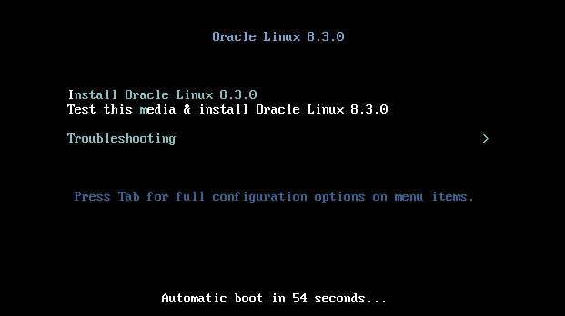

# Guia de Instalação do Oracle Linux em uma Máquina Virtual

*Autor: Taciano da Hora*  
[Repositório no Github](https://github.com/taciodev/guia-instalacao-oracle-linux-vm)

## Introdução

O Oracle Linux 8 é um sistema operacional gratuito e de código aberto desenvolvido para atender às necessidades dos desenvolvedores em sua jornada de trabalho com uma ampla gama de ferramentas e tecnologias.

## Requisitos

Antes de começar, certifique-se de que você possui:

- Uma máquina com o VirtualBox instalado.
- O arquivo ISO do Oracle Linux 8.x. Você pode baixá-lo [aqui](https://yum.oracle.com/oracle-linux-isos.html).

## Configurando a Máquina Virtual

### Passo 1: Baixar o Arquivo ISO do Oracle Linux 8

O primeiro passo é obter o arquivo .iso da versão 8 do Oracle Linux. Você pode fazer isso visitando a página oficial de download do Oracle Linux 8 [aqui](https://yum.oracle.com/oracle-linux-isos.html).

### Passo 2: Criar uma Nova Máquina Virtual

Agora, vamos configurar a máquina virtual para a instalação do Oracle Linux 8. Siga os passos abaixo:

1. Abra o VirtualBox e clique em **Novo** para criar uma nova máquina virtual.

   

2. Nomeie a máquina virtual, selecione a versão Oracle (64 bits) e escolha a opção **imagem ISO**. Em seguida, selecione o arquivo ISO do Oracle Linux 8 que você baixou e clique em **Avançar**.

   

3. Configure as opções de instalação, como nome de usuário, senha e nome da máquina. Você também pode habilitar a instalação dos "Adicionais para Convidados". Clique em **Avançar** para prosseguir.

   

4. Escolha a quantidade de RAM e CPUs para a máquina virtual. É recomendado alocar 4 GB de RAM e 1 CPU para garantir um desempenho adequado. Clique em **Avançar** para continuar.

   

5. Selecione a opção **Criar um novo disco rígido virtual agora** e clique em **Avançar**.

   

6. Escolha o local e o tamanho do arquivo do disco rígido virtual e clique em **Criar** para finalizar a criação do disco virtual. Agora você será redirecionado para a tela do VirtualBox.

### Instalando o Oracle Linux 8

Depois de configurar a máquina virtual, siga os passos abaixo para instalar o Oracle Linux 8:

1. Inicie a máquina virtual clicando em "Iniciar" no VirtualBox.

   

2. Na tela de inicialização, selecione a opção "Instalar Oracle Linux 8.3.0" e pressione Enter para iniciar a instalação.

   

3. Uma tela de boas-vindas será exibida. Selecione o idioma Inglês e clique no botão Continuar. Prossiga com as etapas seguintes.

   

4. Na tela "Resumo da Instalação", você encontrará várias opções de configuração. Certifique-se de atualizar todas as opções, especialmente aquelas com marcas de alerta, antes de iniciar o processo de instalação. Observe que o botão "Iniciar instalação" estará desabilitado até que todas as opções com alertas sejam corrigidas.

   

5. Após corrigir todas as configurações, o botão "Iniciar instalação" estará habilitado. Clique nele para iniciar o processo de instalação.

   

6. Aguarde enquanto o Oracle Linux 8 é instalado na sua máquina virtual. Esse processo pode levar algum tempo.

   

7. Após a conclusão da instalação, você receberá uma mensagem informando que o processo terminou. Clique no botão "Reiniciar sistema" para continuar o processo de instalação.

   

8. Aguarde enquanto o sistema reinicia. Quando a reinicialização for concluída, você verá a tela de configuração final, com o botão "Concluir configuração" desativado. Clique em "Informações sobre licença" na seção de licenciamento.

   

9. Marque a caixa de seleção "Aceito o contrato de licença" e clique em "Concluído" para continuar.

   Agora, você concluiu a instalação do Oracle Linux 8 na sua máquina virtual. Parabéns!
